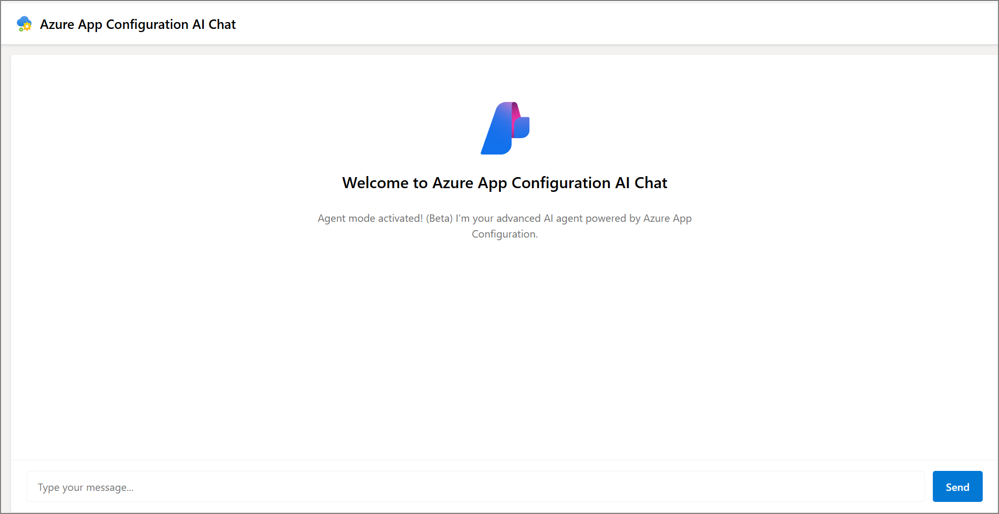
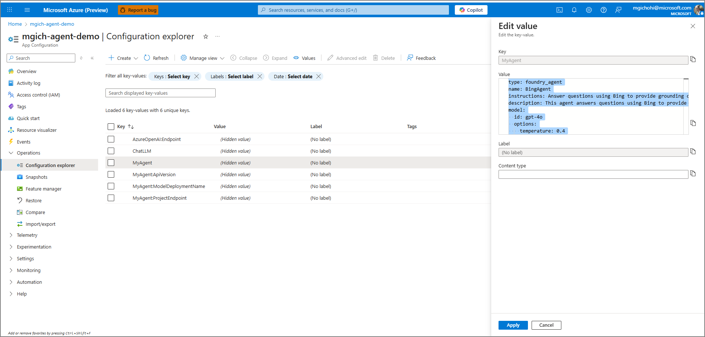

# Azure AI Agent Configuration Chat Demo

This demo shows how to build an intelligent chat application using **Azure AI Agents** with configuration managed through **Azure App Configuration**. The app dynamically loads settings and can switch between regular chat and advanced agent modes.

## Note 
This repository builds upon the [AIConfigurationSample](https://github.com/mrm9084/AzureAppConfigurationAiConfigurationSample) by adding Azure AI Agent capabilities.




## What This Demo Shows

- 🤖 **Azure AI Agent Integration**: Chat with an intelligent AI agent powered by Azure Foundry
- ⚙️ **Dynamic Configuration**: Agent configuration update automatically from Azure App Configuration
- 🔄 **Live Config Updates**: Change AI behavior without restarting the application
- 🎛️ **Feature Flags**: Toggle between regular chat and advanced agent mode
- 🔐 **Secure Configuration**: API keys stored safely in Azure Key Vault

## Project Structure

- **Backend**: Python Flask API that manages AI agents and configuration
- **Frontend**: TypeScript/Vite web application with a clean chat interface

## Prerequisites

- [Python 3.8+](https://www.python.org/downloads/)
- [Node.js 16+](https://nodejs.org/) and npm
- An Azure subscription with these services:
  - [Azure AI Agent](https://learn.microsoft.com/en-us/azure/ai-foundry/agents/how-to/tools/bing-grounding#setup)
  - [Azure App Configuration](https://learn.microsoft.com/en-us/azure/azure-app-configuration/quickstart-azure-app-configuration-create?tabs=azure-portal)
  - [Azure Key Vault](https://learn.microsoft.com/en-us/azure/azure-app-configuration/use-key-vault-references-dotnet-core#create-a-vault)
  - [Grounding wwith Bing search](https://learn.microsoft.com/en-us/azure/ai-foundry/agents/how-to/tools/bing-grounding#setup)

## Setup Instructions

### 1. Frontend Setup

1. Navigate to the Frontend directory:
   ```
   cd Frontend
   ```

1. Install dependencies:
   ```
   npm install
   ```

1. Build the project:
   ```
   npm run build
   ```

1. Start the development server:
   ```
   npm run dev
   ```
   The frontend will be available at `http://localhost:5173`

### 2. Set Up the Backend

Navigate to the Backend folder and install Python dependencies:
```bash
cd Backend
pip install -r requirements.txt
flask run
```
The API will run at `http://localhost:5000`

### 3. Configure Azure Services

You'll need to set up configuration in **Azure App Configuration** with these key settings:

#### Required Configuration Keys

**AI Agent Configuration** (`MyAgent`):
```yaml
type: foundry_agent
name: BingAgent
instructions: Answer questions using Bing to provide grounding context.
description: This agent answers questions using Bing to provide grounding context.
model:
  id: gpt-4o
  options:
    temperature: 0.4
tools:
  - type: bing_grounding
    options:
      tool_connections:
        - ${BingConnectionId}  # Your bing connection Id, can be stored as key vault reference and resolved at runtime
      freshness: Day # Can be configured see https://learn.microsoft.com/en-us/azure/ai-foundry/agents/how-to/tools/bing-grounding#optional-parameters
      count: 3
```

**Agent Connection Settings**:
- `MyAgent:ProjectEndpoint` = Your Azure AI Foundry project endpoint
- `MyAgent:ModelDeploymentName` = Your model deployment name  
- `MyAgent:ApiVersion` = API version (e.g., "2024-07-01-preview")

**Feature Flag for Agent Mode**:
- Key: `Beta` 
- Value: `true` (enables advanced agent features) or `false` (basic chat mode)

**Legacy Chat Configuration** (for non-agent mode):
- `ChatLLM` = JSON configuration for basic chat
- `AzureOpenAI:Endpoint` = Your Azure OpenAI endpoint
- `AzureOpenAI:ApiKey` = Key Vault reference to your API key

#### Authentication Setup:

The application uses DefaultAzureCredential for authentication, which requires either:

   1. Authentication via Visual Studio / Visual Studio Code
   1. Authentication via Azure CLI
   1. Managed identity (for deployment scenarios)

**Required Permissions:**
Your Azure account needs these permissions:
- **Azure App Configuration**: `App Configuration Data Reader` role
- **Azure Key Vault**: `Key Vault Secret User` role for the key vault containing the `BingConnectionId`
- [Azure AI Foundry project roles](https://learn.microsoft.com/en-us/azure/ai-foundry/concepts/rbac-azure-ai-foundry?pivots=fdp-project)

## How It Works

### Configuration Refresh
The application is configured to automatically refresh configuration settings from Azure App Configuration every 30 seconds, allowing real-time updates to AI model settings, agent configuration, or feature flags without restarting the service.

### Two Chat Modes
1. **Agent Mode** (when `Beta` feature flag is `true`):
   - Uses Azure AI Foundry agents with Grounding bing search tool that allows your Azure AI agent to incorporate real-time public web data when generating responses.
   - Supports conversation threads and complex interactions
   
2. **Basic Chat Mode** (when `Beta` feature flag is `false`):
   - Direct Azure OpenAI integration
   - Simple request/response chat interface

## Using the Application

1. **Start both frontend and backend** (see Quick Start above)
2. **Open your browser** to `http://localhost:5173`
3. **Start chatting!** The AI will respond using your configured model
4. **Try changing settings** in Azure App Configuration to see live updates

## Troubleshooting

**Common Issues:**

**"Authentication failed"**
- Make sure you're logged in: `az login`
- Check your permissions in Azure App Configuration, Key Vault and Foundry project.


**"Agent creation failed"**
- Check your project endpoint and model deployment name in Foundry
- Verify the `Beta` feature flag is enabled if using agent mode

**"CORS errors in browser"**
- Ensure the Flask backend is running on port 5000
- Frontend should be on port 5173

**"Model not responding"**
- Verify your Azure AI model deployment is active


## Next Steps

- **Try different agent tools** like code interpreter, azure ai search etc.
- **Toggle the Beta feature flag** to see the difference between modes
- **Try different agent types** by updating settings in Azure App Configuration

## Architecture

```
┌─────────────────┐    ┌─────────────────┐    ┌─────────────────┐
│   Frontend      │    │   Flask API     │    │  Azure Services │
│  (TypeScript)   │◄──►│   (Python)      │◄──►│                 │
│                 │    │                 │    │ • App Config    │
│ • Chat UI       │    │ • Agent Manager │    │ • Foundry       │
│ • Real-time     │    │ • Config Sync   │    │ • Key Vault     │
└─────────────────┘    └─────────────────┘    └─────────────────┘
```